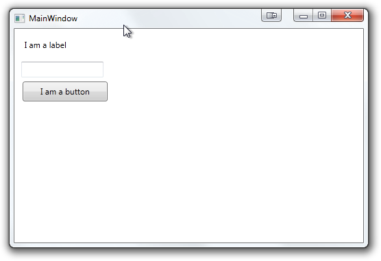

#MahApps.Metro Documentation

<pre class="nuget-button">Install-Package MahApps.Metro</pre>

Last updated for stable release 0.10.1 (released 2013/3/24).

<h3>Sponsored by <a href="http://www.aimsoftware.com/">Aim Software</a></h3>

<h2 class="toc-header">Contents</h2>
* Auto-generated toc: {:toc}

##Foreword
###Metro isn't for everything

Microsoft have demonstrated both sides of metro - it can look absolutely stunning if it is done well, or absolutely woeful if done poorly. Not *every* application translates well into a metro interface. If you're designing a complex *tool* such as Visual Studio, it's probably best to avoid a heavy-typography based UI style.

Of course, there will always be exceptions to the rule, but just because metro *looks* simplistic does not mean the design isn't complex. The more complex an application, the more time (generally) you'll need to spend on the design. 

###No UI kit does design for you

While MahApps.Metro strives to make *good looking* metro interfaces easier, but just like with Windows Form or "default" WPF, a designer (or at least thinking about design) is needed to create a *good* interface. This is a combination of aesthetic and usability.

###Fonts

Segoe UI, Segoe WP and Zegoe UI are all Microsoft/Ascender fonts. They will not be embedded in MahApps.Metro.

##Examples

* [Windows Phone Power Tools](http://wptools.codeplex.com/)
* [MarkPad](http://code52.org/DownmarkerWPF)
* [Carnac](http://code52.org/carnac/)

##Getting Started

- [Installing MahApps.Metro](#installing_mahappsmetro)
- [Styling a Window](#styling_a_window)
- [Explaining the MetroWindow elements](#explaining_the_metrowindow_elements)
- [Customisation](#customisation)
- [Advanced](#advanced)

###Installing MahApps.Metro

You can install MahApps.Metro via Nuget using the GUI (right click on your project, Manage Nuget References, search for 'MahApps.Metro') or via the console:

<pre class="nuget-button">Install-Package MahApps.Metro</pre>

If you wish to use the *alpha* releases of MahApps.Metro, you need to include "pre" releases in Nuget (1.7 and above) 

or use the console (`PM> Install-Package MahApps.Metro -Pre`)

###Styling a Window
There are two main approaches you can take with MahApps.Metro to style a Window, using the `MetroWindow` control, or rolling your own. For the getting started guide, we'll use `MetroWindow`, as this approach will work for a good percentage of apps and is the quickest and easiest way to get going. Rolling your own styling is covered in the later "Advanced" section.

A default WPF Window with a few controls looks like the following:

Once MahApps.Metro is [installed](#installing_mahappsmetro),

* open up `MainWindow.xaml`
* add a namespace reference in the opening Window tag:  
`xmlns:Controls="clr-namespace:MahApps.Metro.Controls;assembly=MahApps.Metro"`

* change `<Window ...` to `<Controls:MetroWindow ...` (remember to change the closing tag!)

You'll need to change the codebehind (`MainWindow.xaml.cs`, right-click the designer and select 'View source') so that the inherited class matches the XAML, so `public partial class MainWindow : Window` becomes `public partial class MainWindow : MetroWindow`.

That being said - usually you can just drop the inheritance on a partial declaration. This basic MetroWindow will look like this:

This doesn't look very 'metro'-ish yet because the resources and styles need to be included. Unfortunately you need to include these resources in each Window.

> We have tried embedding the resources and styles in `MetroWindow`, but then you lose all ability to dynamically change the theme.

Just under the opening MetroWindow tag, add the following
	
	   <Window.Resources>
	        <ResourceDictionary>
	            <ResourceDictionary.MergedDictionaries>
	                <ResourceDictionary Source="pack://application:,,,/MahApps.Metro;component/Styles/Colours.xaml" />
	                <ResourceDictionary Source="pack://application:,,,/MahApps.Metro;component/Styles/Fonts.xaml" />
	                <ResourceDictionary Source="pack://application:,,,/MahApps.Metro;component/Styles/Controls.xaml" />
	                <ResourceDictionary Source="pack://application:,,,/MahApps.Metro;component/Styles/Accents/Blue.xaml" />
	                <ResourceDictionary Source="pack://application:,,,/MahApps.Metro;component/Styles/Accents/BaseLight.xaml" />
	            </ResourceDictionary.MergedDictionaries>
	        </ResourceDictionary>
	    </Window.Resources>
	

And now we have a semi-decent looking window!

###Explaining the MetroWindow elements

If you don't like the elements that are labelled, fear not, they're all optional.

1. The titlebar is what sets `MetroWindow` apart from rolling your own. `ShowTitleBar="true|false"`
2. Instead of using static images, this uses a font called **Marlett**.
3. The resize grip is no longer (from 0.8 onwards) the *only* way to resize a `MetroWindow` - all edges and corners can be gripped, but given a metro window doesn't have a noticeable window "chrome" like an aero window, the resize grip can help reassure users
4. `ShowIconOnTitleBar="true|false"` 

###Customisation
####WindowCommands
`WindowCommands` are the minimise, maximise/restore, and close buttons. You can add your own controls to `WindowsCommands` - by default, buttons have a style automatically applied to them to make them fit in with the rest of the `WindowsCommands`. As of 0.9, you are no longer limited to just buttons, but any control. Be aware, you're responsible for styling anything other than buttons.

Including this within the `MetroWindow` tag (under the `Window.Resources` section),

	<Controls:MetroWindow.WindowCommands>
	    <Controls:WindowCommands>
	        <Button Content="settings" />
            <Button>
                <StackPanel Orientation="Horizontal">
                    <Rectangle Width="20" Height="20">
                        <Rectangle.Resources>
                            <SolidColorBrush x:Key="BlackBrush" Color="White" />
                        </Rectangle.Resources>
                        <Rectangle.Fill>
                            <VisualBrush Stretch="Fill" Visual="{StaticResource appbar_cupcake}" />
                        </Rectangle.Fill>
                    </Rectangle>
                    <TextBlock Text="deploy cupcakes" />
                </StackPanel>
            </Button>
        </Controls:WindowCommands>
	</Controls:MetroWindow.WindowCommands>

> Make sure to include the [icons](#icons) to get the cupcake

Produces this window titlebar:

The foreground (link) colour of `WindowCommands` will always be white, *unless* the titlebar is disabled, in which case it will be the reverse of whatever theme you have selected. For example, using the White/Light theme, the foreground colour will be black.

###Advanced
####Roll your own Window

The roll your own approach is very relevant, depending on what style of app you're going for. A good example is [code52's MarkPad](http://code52.org/DownmarkerWPF/), where we needed the flexibility of rolling our own window while still using MahApps.Metro as an underlying visual framework. The key elements used were the `WindowCommands` (discussed [above](#windowcommands)), and `BorderlessWindowBehavior`.

#####BorderlessWindowBehavior

Add some namespace references to the opening `Window` tag:

	xmlns:i="http://schemas.microsoft.com/expression/2010/interactivity"
	xmlns:Behaviours="clr-namespace:MahApps.Metro.Behaviours;assembly=MahApps.Metro"

Then somewhere within the `Window`, add

    <i:Interaction.Behaviors>
        <Behaviours:BorderlessWindowBehavior/>
    </i:Interaction.Behaviors>

And you're done! `BorderlessWindowBehavior` has a few options, such as `ResizeWithGrip` and `AutoSizeToContent`:

	<Behaviours:BorderlessWindowBehavior ResizeWithGrip="False" />

##Controls
Most of the controls are demonstrated in the sample application which you can pull down from [source](https://github.com/mahapps/mahapps.metro/). 

There are three categories of controls in MahApps.Metro

* Implicit template/styles that replace the look of existing controls (such as `Textbox`, `Button`, or `Scrollbar`)
* Explicit template/styles that require you to set the *style* of a control (such as `ChromelessButtonStyle`)
* New controls (such as `ToggleSwitch` or `MetroWindow`)

###MetroWindow
`MetroWindow` is detailed in the [getting started](#styling_a_window) section. One property not detailed is the `SaveWindowPosition` (true/false, default false) option. Setting this property to `true` will mean on next launch, it will automatically be positioned and sized to what it was on exit. This is designed to improve UX and speed development as its one of those "plumbing" UI things that is done regularly.  

Be careful though - if a monitor is detached during application exit and restart, or if certain circumstances arise, your application may launch off screen. Be sure to provide a 'reset' option or handle that in code.
  
###Panorama

`Panorama`s are sideways scrolling (typically tile) lists, found in Windows Phone 7, Windows 8 (the "metro" start screen) and in select parts of the Zune interface.

A `Panorama` can be databound, but because of it's nature it needs a different type of collection. Specifically, `Panorama`s bind to a(n observable) collection of `PanoramaGroup`s. 

 	<Controls:Panorama ItemBox="140" ItemsSource="{Binding Groups}" />

And then on the `ViewModel`

	
	public ObservableCollection<PanoramaGroup> Groups { get; set; }
	...
	public ViewModel()
	{
		tracks = new PanoramaGroup("trending tracks");
		artists = new PanoramaGroup("trending artists");
		Groups = new ObservableCollection<PanoramaGroup> { tracks, artists };
	}
	
	...
	public void GetDataCallback()
	{
	 	tracks.SetSource(x.Tracks.track.Take(25));
	}

###Buttons
####Standard Button
This just replaces the standard button when you drop in the library, nothing fancy to activate it    

####MetroCircleButton  
"Standard" circle button, designed for icons.  
Add the following to a button to apply this style: `Style="{DynamicResource MetroCircleButtonStyle}"`  

####AppBarButton &#91;Obsolete\]
Inspired by Windows Phone 7's app bar buttons which are a circle button with text underneath.  
  
Use the `AppBarButton` control to use this type of button.  

    <Controls:AppBarButton
       VerticalAlignment="Top"
       MetroImageSource="{StaticResource appbar_barcode}"
       Foreground="{DynamicResource BlackBrush}"
       Content="scan" />  

> Due to issues with this control, `AppBarButton` is due to be removed for v1.0

####Square button 
Another WP7 styled button, this time just for text. Like all the buttons here, has normal, clicked, and hover states.  
  
Add the following to a button to apply this style: `Style="{DynamicResource SquareButtonStyle}"`

####FlatButton
This sort of button can be found when you're making a call on Windows Phone - all of the controls (hang up, keypad, etc) are 'flat buttons'.  
  
Flat button lives in   
`<ResourceDictionary Source="pack://application:,,,/MahApps.Metro;component/Styles/FlatButton.xaml" />`

You'll need to import that as well to use it.

###Toggle Switch
The `ToggleSwitch` control originally appeared in Windows Phone 7, but has made its way into Windows 8. The MahApps.Metro version of this control uses the Windows Phone 7 code (ported), but the Windows 8 visuals.

The function is very similar to that of a checkbox, but easier to differentiate and easier to use with touch interfaces. Basically though, it can be thought of as a pretty `CheckBox`

`<Controls:ToggleSwitch Header="WiFi rest state" />`

  

You can bind to/set `IsChecked` to switch between the two states.  You can change the *on* and *off* labels by setting `<Controls:ToggleSwitch OnLabel="Yes" OffLabel="No" />`

###TextBox
There is just the one style in this library for `TextBox`, however it does have a special attached property for creating 'watermarked' textboxes and for added a 'clear' button.

**What is a watermark?**  
Watermarked - in the context of textboxes - refers to text that appears in the textbox *before* the user has focussed or entered text. This is often an alternative to having a set of labels, you can instead just have a textbox with a watermark like 'search terms go here'.

**Why AttachedProperty?**  
The easiest way (for me) would have been to add a custom control, something like `<WatermarkedTextBox`, but then that's another control you have to use rather than just the style definitions at the top. The attachedproperty makes it entirely opt in if you want the watermark.

####Watermark usage

``<TextBox Controls:TextboxHelper.Watermark="This is a textbox" />``

Will produce a textbox that looks like the below image. The three states are *unfocussed* with no user text entered, focussed, and unfocussed with user text.

####Clear text button usage
Like the watermark, a simple attached property adds in the functionality

``<TextBox Controls:TextboxHelper.ClearTextButton="True" />``

Which will give you

This can be combined with - but doesn't require - the watermark attachedproperty

###Progress Ring
The Progress Ring control is styled after a similar control in Windows 8 to indicate activity rather than a percentage of progress completed.
``<Controls:ProgressRing IsActive="True" />``

`IsActive` can easily be bound to a view model property. Override `Foreground` if you wish to change the colour.

###Tabs
There are three included tab styles - Animated Tab Control, Single Row Animated Tab Control and the default Tab Control. The default Tab Control style is included in `Controls.xaml`, but the other two require specific referencing (make sure to do this *after* a reference to `Controls.xaml`)

**Default look**  
  
This shows the three states - selected/active tab, hover and inactive.

####AnimatedTabControl
``<ResourceDictionary Source="pack://application:,,,/MahApps.Metro;component/Styles/Controls.AnimatedTabControl.xaml" />``
Functioning just like the regular tab control, except it animates every tab change by wrapping everything in a `MetroContentControl`.  
 

####AnimatedSingleRowTabControl
``<ResourceDictionary Source="pack://application:,,,/MahApps.Metro;component/Styles/Controls.AnimatedSingleRowTabControl.xaml" />``
`AnimatedSingleRowTabControl` functions exactly the same as the `AnimatedTabControl` except the tabs will only appear on a single line rather than wrapping. Instead of wrapping, arrows (left/right) are presented.   

  

###Range Slider
  

Taken from the [Avalon Controls Library](http://avaloncontrolslib.codeplex.com/) (MS-PL), `RangeSlider` lets you select a range of values with a slider, rather than a single value.

	<Controls:RangeSlider 
		Height="25" 
		RangeStartSelected="{Binding DarkestValue, Mode=TwoWay}" 
		RangeStopSelected="{Binding LightestValue, Mode=TwoWay}" />

###TransitioningContentControl
Taken from Silverlight (specifically [this](https://github.com/jenspettersson/WPF-Controls) port), `TransitioningContentControl` is great for switching content smoothly around. At it's core, `TransitioningContentControl` is a `ContentControl`, so only one child element can be displayed at a time. When you change the content, an animation is played switching the two.

`<Controls:TransitioningContentControl x:Name="transitioning" Width="150" Height="50" Transition="DownTransition" />`

Built in there are several transitions:  

* DownTransition
* UpTransition
* RightTransition
* LeftTransition
* RightReplaceTransition
* LeftReplaceTransition
                            
This is still a 'work in progress' control, so there are some limitations - at the moment you can't provide a custom transition without overriding the style of the control.

## Known issues

### No automatic binding on WindowCommands with Caliburn.Micro
[Caliburn.Micro](http://caliburnmicro.codeplex.com) automatically binds on the visual tree and a couple of other locations, which doesn't cover how MahApps.Metro's awesome `WindowCommands` are implemented. To work around this issue for a simple button to action binding, first add the `cal` namespace to the root element (usually `Controls:MetroWindow`):

    xmlns:cal="http://www.caliburnproject.org"
    
Then explicity attach the button to the action:

	<Controls:MetroWindow.WindowCommands>
		<Controls:WindowCommands>
			<Button x:name="About" Content="about" cal:Message.Attach="NavigateToAbout"/>
		</Controls:WindowCommands">
	</Controls:MetroWindow.WindowCommands>
        

##Resources

###Icons

MahApps.Metro does not embed any icons or "resources" other than control styles. However, there is *[MahApps.Metro.Resources](http://nuget.org/packages?q=MahApps.Metro.Resources)* package. This allows better discoverability and customisation.

You can install this package using nuget:

<pre class="nuget-button">Install-Package MahApps.Metro.Resources</pre>

Currently, this consists of [Entypo](http://www.entypo.com/) and [Temparian's Windows Phone Icon pack](http://templarian.com/project_windows_phone_icons/)

####Usage
The resources are simply `Canvas`'s wrapping one or more `Path`s. To use these sorts of elements, you can just use WPF's `VisualBrush`.

	<Window.Resources>
        <ResourceDictionary>
            <ResourceDictionary.MergedDictionaries>
                <ResourceDictionary Source="/Resources/Icons.xaml" />
            </ResourceDictionary.MergedDictionaries>
        </ResourceDictionary>
    </Window.Resources>
    
    <Rectangle>
        <Rectangle.Fill>
            <VisualBrush Visual="{StaticResource appbar_add}" />
        </Rectangle.Fill>
    </Rectangle>
    
If you're trying to create "circle" buttons ala Windows Phone 7, the easiest way is to set the `VisualBrush` to be an *`OpacityMask`* on the `Rectangle`. This means you just need to alter the `Rectangle` colours on state change (hover, mouse down, etc)

	<Rectangle Fill="Black">
		<Rectangle.OpacityMask>
			<VisualBrush Visual="{StaticResource appbar_add}" Stretch="Fill" />
		</Rectangle.OpacityMask>
	</Rectangle>

##Credits
<ul id="contributors">
</ul>

###Documentation
This document uses the [metro.css](http://code52.org/metro.css/) framework, a [code52](http://code52.org) project.

NuGet button style is provided by [nuget-button](https://github.com/prabirshrestha/nuget-button) by [Prabir Shrestha](http://blog.prabir.me/).
 
