

  
  <h1>MahApps.Metro</h1>
  

    A toolkit for creating metro-style WPF applications. Lots of goodness out-of-the box.
  

  
  
   
  
  
  
  
   
  
  
  
   
  
  
  
  

<h2>Want to say thanks?</h2>

This framework is free and can be used for free, open source and commercial applications. It's tested and contributed by many people... So mainly hit the :star: button, that's all... thx :squirrel: (:dollar:, :euro:, :beer: or some other gifts are also being accepted...).

<h2>Let's get started</h2>

- [Documentation](https://github.com/MahApps/MahApps.Metro/wiki/Documentation)
- [Releases and Release Notes](https://github.com/MahApps/MahApps.Metro/releases)
- [Quick Start](https://github.com/MahApps/MahApps.Metro/wiki/Quick-Start)
- [Icons](https://github.com/MahApps/MahApps.Metro/wiki/Icons) (MahApps.Metro.IconPacks)
- [Contributing](https://github.com/MahApps/MahApps.Metro/wiki/Contributing) to MahApps.Metro
- [Building](https://github.com/MahApps/MahApps.Metro/wiki/Building-the-MahApps.Metro-solution) the MahApps.Metro solution
- [Visual Studio Templates](https://github.com/MahApps/MahApps.Metro/wiki/Visual-Studio-Templates)
- [Wiki](https://github.com/MahApps/MahApps.Metro/wiki)

<h2>Something missing?</h2>

If you're looking for another awesome libraries which are compatible with MahApps, check them out:

- [MaterialDesignInXamlToolkit](https://github.com/ButchersBoy/MaterialDesignInXamlToolkit) Google Material Design in XAML & WPF, for C# & VB.Net [http://materialdesigninxaml.net](http://materialdesigninxaml.net)
- [MahApps.Metro.SimpleChildWindow](https://github.com/punker76/MahApps.Metro.SimpleChildWindow) A simple child window for MahApps.Metro
- [Loading indicators](https://github.com/100GPing100/LoadingIndicators.WPF) by [@100GPing100](https://github.com/100GPing100)
- [Dragablz](https://github.com/ButchersBoy/Dragablz) Tearable tab control for WPF, which includes docking, tool windows and MDI. [http://dragablz.net](http://dragablz.net)

<h2>Tools</h2>

We use these awesome tools to build and develop MahApps.Metro.

  <a href="https://cakebuild.net/">
    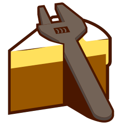
  </a>
  
  <a href="https://www.appveyor.com/">
    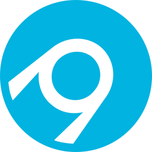
  </a>

<h2>Screenshots</h2>

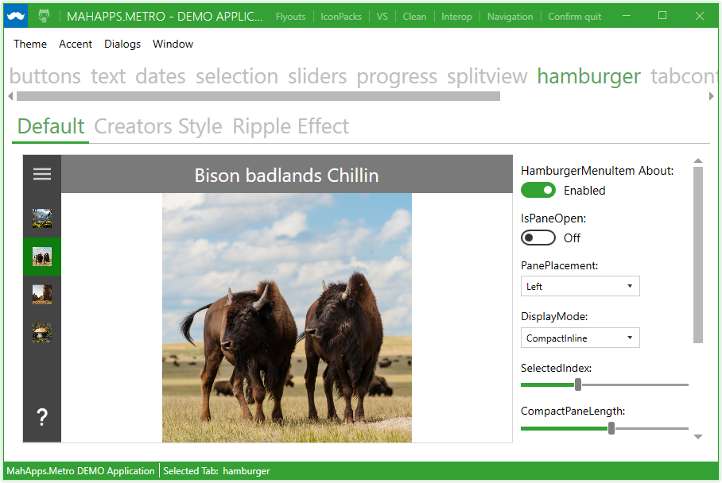

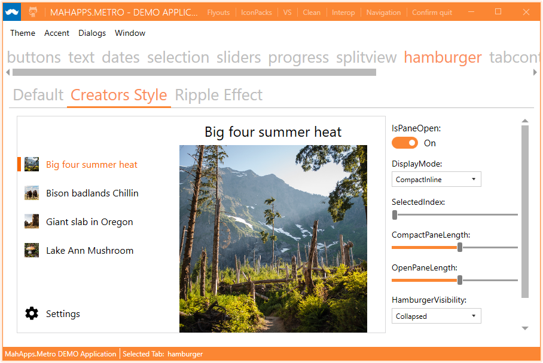

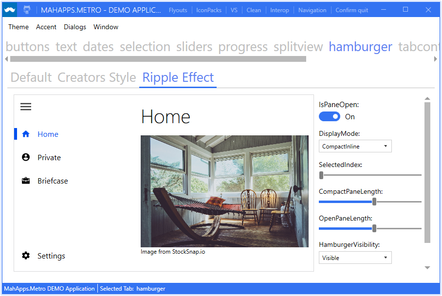

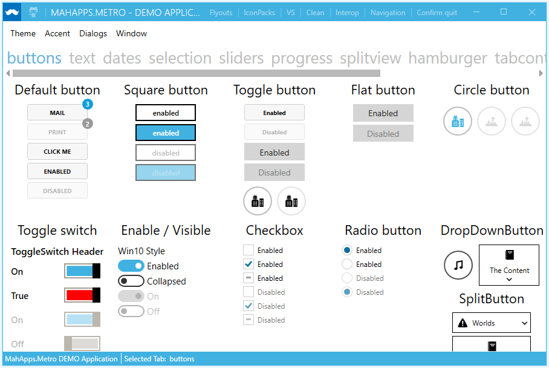

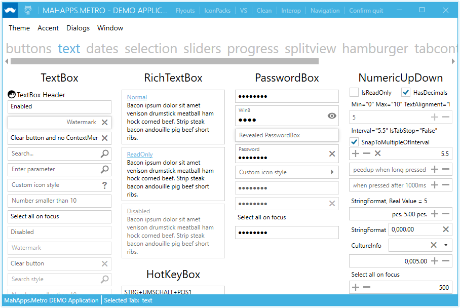

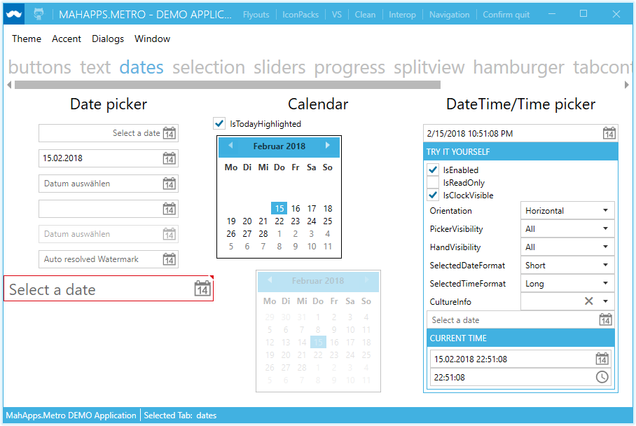

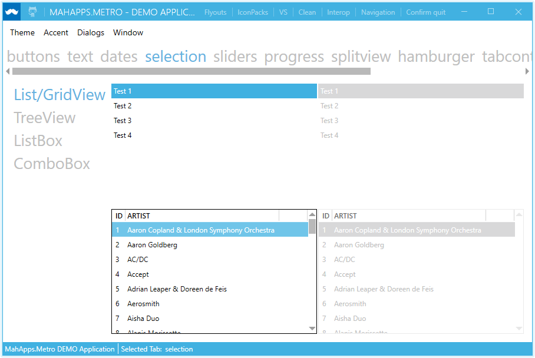

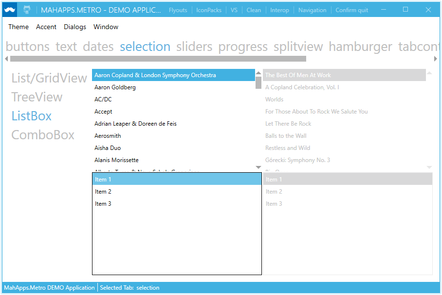

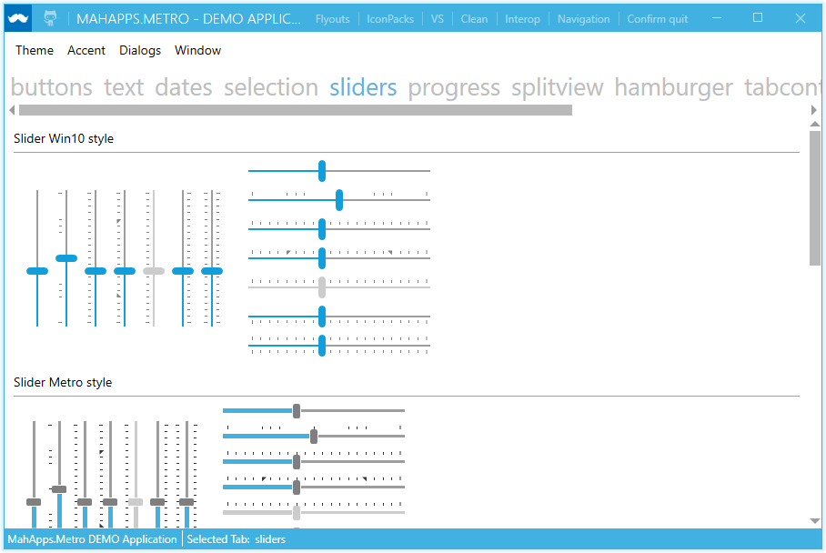

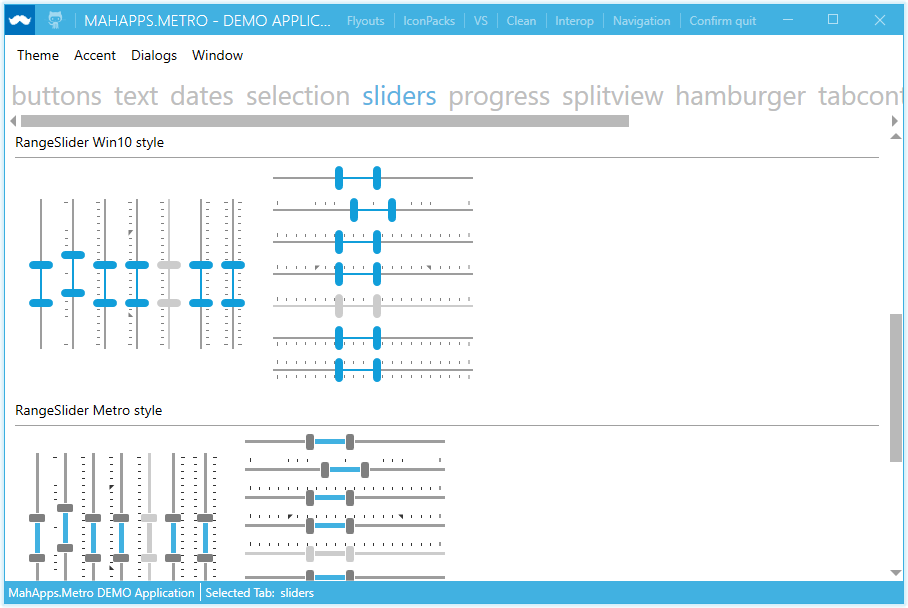

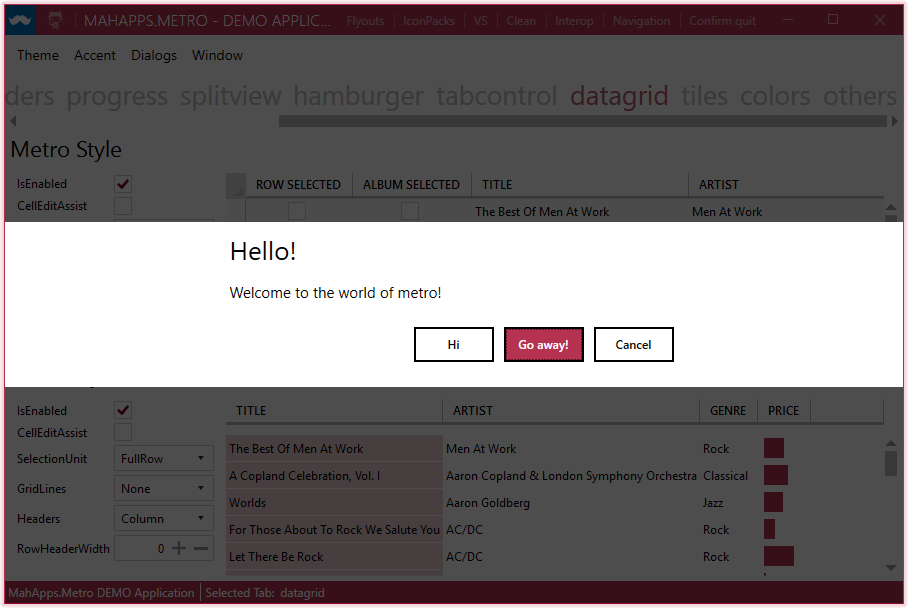

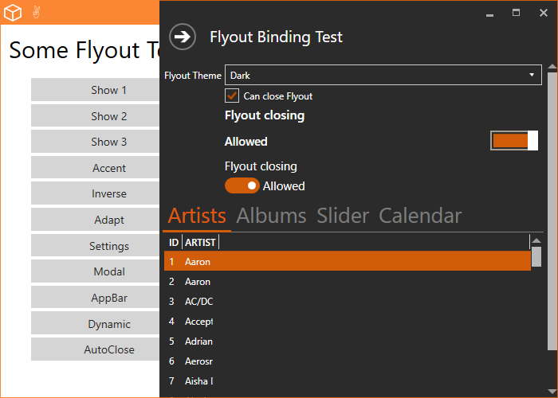

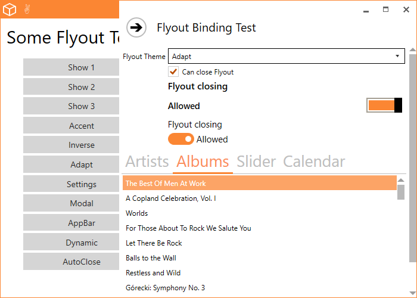

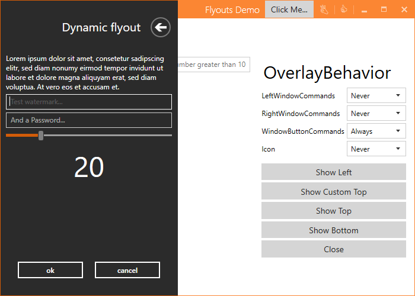

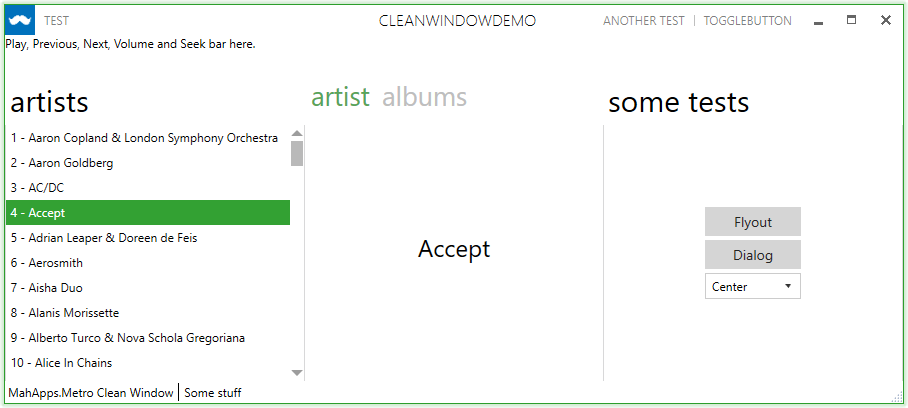

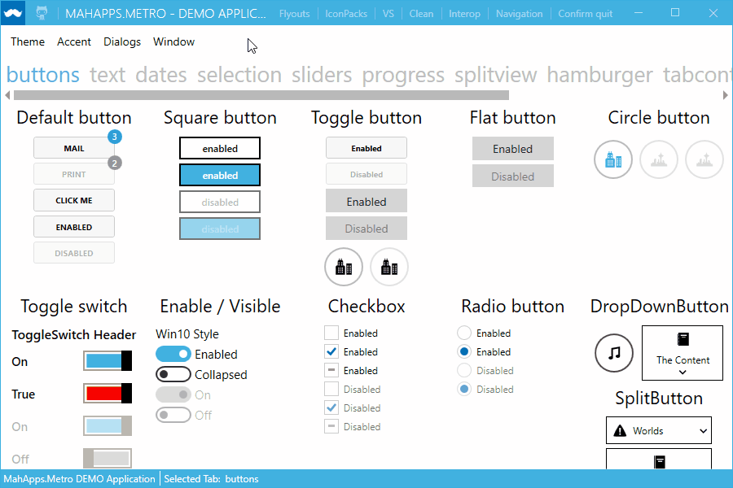

<h2>Licence</h2>

[MIT License (MIT)](./LICENSE)
