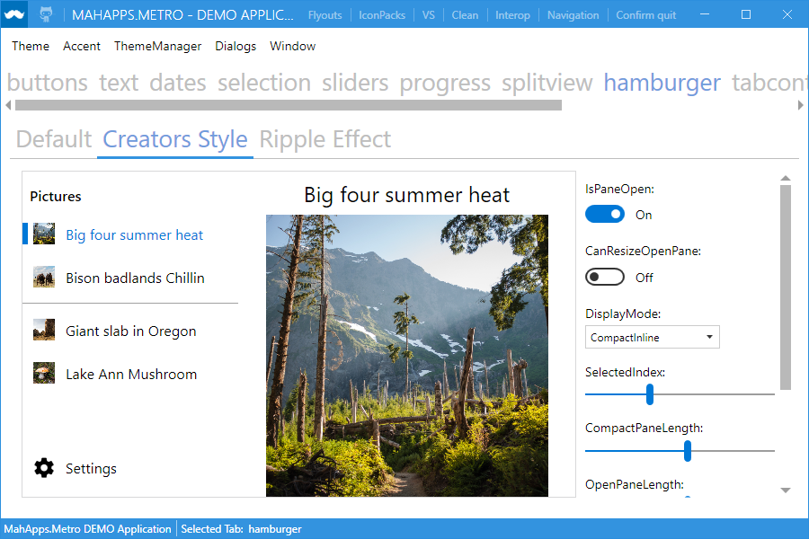
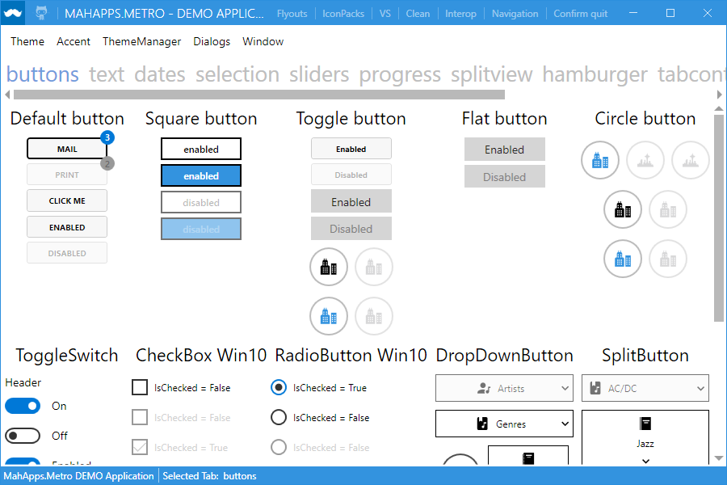
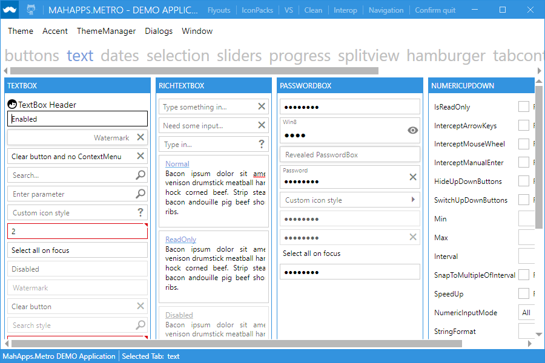
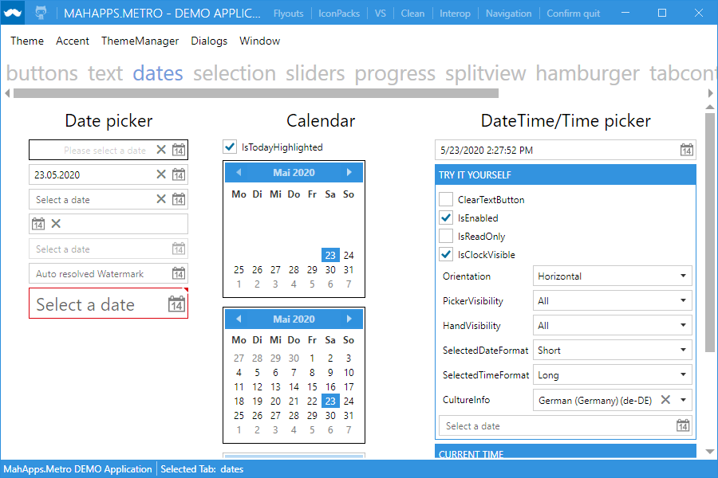
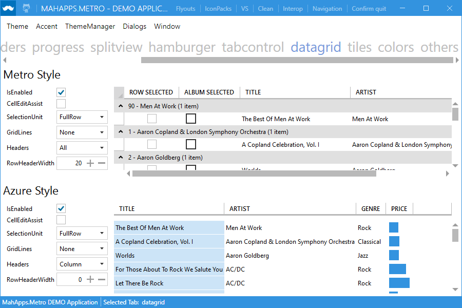
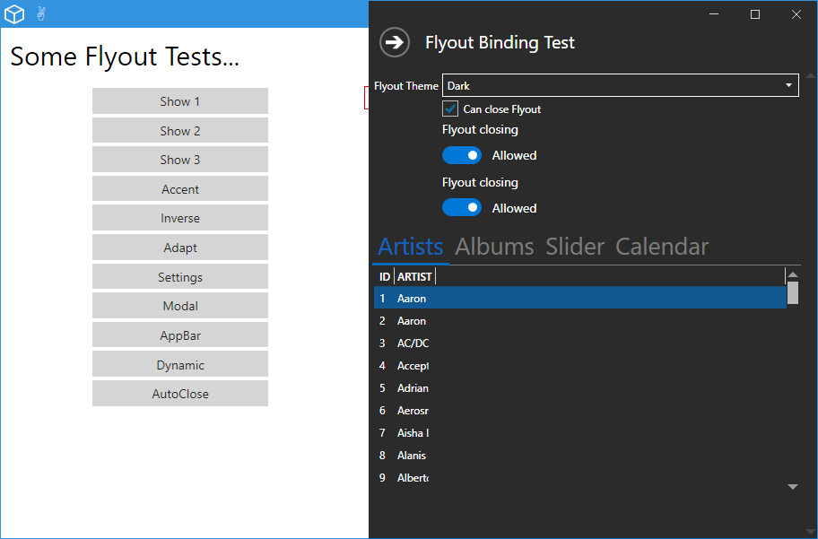
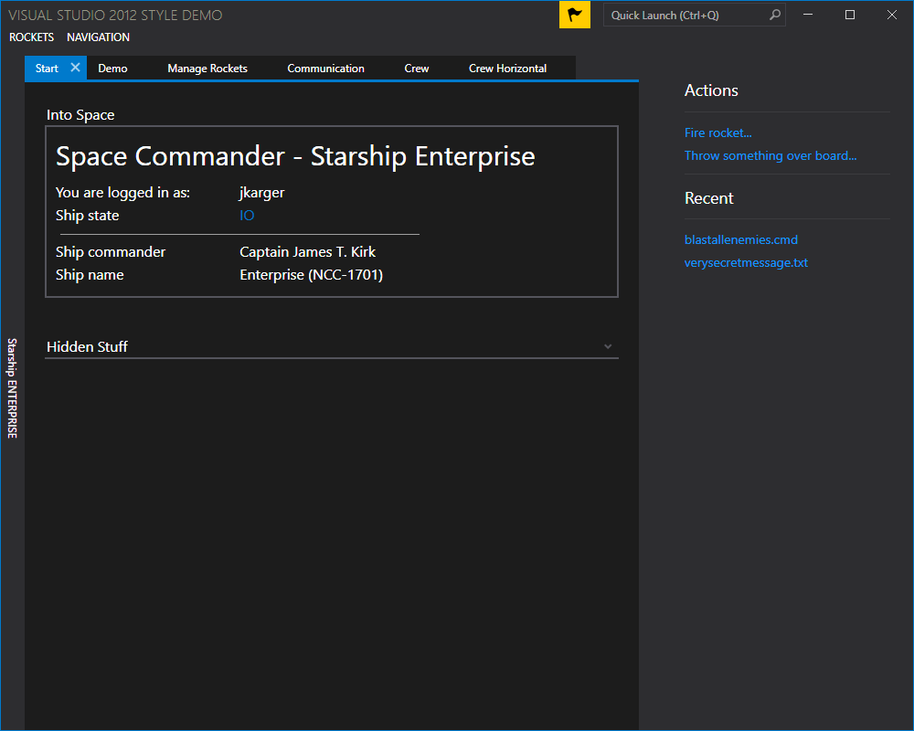

  
  <h1>MahApps.Metro</h1>
  

    A toolkit for creating modern WPF applications. Lots of goodness out-of-the box.
  

  

    Supporting .NET Framework (4.5+) and .NET Core (3.0 and 3.1)
  

  
  
  
  
  
   
  
  
  
   
  
  
  
  

## Let's get started

- [Documentation](https://github.com/MahApps/MahApps.Metro/wiki/Documentation)
- [Quick Start](https://github.com/MahApps/MahApps.Metro/wiki/Quick-Start)
- [Icons](https://github.com/MahApps/MahApps.Metro/wiki/Icons) (MahApps.Metro.IconPacks)
- [Contributing](https://github.com/MahApps/MahApps.Metro/wiki/Contributing) to MahApps.Metro
- [Building](https://github.com/MahApps/MahApps.Metro/wiki/Building-the-MahApps.Metro-solution) the MahApps.Metro solution
- [Releases and Release Notes](https://github.com/MahApps/MahApps.Metro/releases)
- [Visual Studio Templates](https://github.com/MahApps/MahApps.Metro/wiki/Visual-Studio-Templates)
- [Wiki](https://github.com/MahApps/MahApps.Metro/wiki)

## Get in touch

## License

Copyright © .NET Foundation, Jan Karger, Brendan Forster, Dennis Daume, Alex Mitchell, Paul Jenkins and contributors.

MahApps.Metro is provided as-is under the MIT license. For more information see [LICENSE](./LICENSE).

## Code of Conduct

This project has adopted the code of conduct defined by the [Contributor Covenant](http://contributor-covenant.org/)
to clarify expected behavior in our community.
For more information see the [.NET Foundation Code of Conduct](http://www.dotnetfoundation.org/code-of-conduct).

## Contribution License Agreement

By signing the [CLA](https://cla.dotnetfoundation.org/MahApps/MahApps.Metro), the community is free to use your contribution to .NET Foundation projects.

## .NET Foundation

This project is supported by the [.NET Foundation](http://www.dotnetfoundation.org).

## Thanks

We use these awesome tools to build and develop MahApps.Metro.

A big thank you has to go to [JetBrains](https://www.jetbrains.com) who provide an [Open Source License](https://www.jetbrains.com/support/community/#section=open-source) for [ReSharper](https://www.jetbrains.com/resharper/) that helps us with the development of MahApps.Metro.

  
  
  

## Contributors

Thanks to all the great people who have already contributed to the project! 

## Sponsoring

This framework is free and can be used for free, open source and commercial applications. MahApps.Metro (all code, NuGets and binaries) are under the [MIT License (MIT)](./LICENSE). It's tested, used and contributed by many awesome people. So hit the magic :star: button, we appreciate it!!! :pray:

The core team members, MahApps.Metro contributors and contributors in the ecosystem do this open source work in their free time. If you use MahApps.Metro a serious task, and you'd like us to invest more time on it, please donate. This project increases your income/productivity/usabilty too.

[Become a sponsor](https://github.com/sponsors/punker76) and show your support to this open source project.

Does your company use MahApps.Metro?  Ask your manager or marketing team if your company would be interested in supporting our project.  Support will allow the maintainers to dedicate more time for maintenance and new features for everyone.  Also, your company's logo can be shown [on GitHub](https://github.com/MahApps/MahApps.Metro#readme) and on [our site](https://mahapps.com) - who doesn't want a little extra exposure?

# :pray: All OpenCollective Backers (archived) :heart:

## MahApps Examples

* [Azuser](https://github.com/Inzanit/azuser) by [@Inzanit](https://github.com/Inzanit) Azure SQL Server User Management
* [Carnac](https://github.com/Code52/carnac) by [@Code52](https://github.com/Code52) the Magnificent Keyboard Utility
* [Certify The Web](https://github.com/webprofusion/certify) by [@webprofusion](https://github.com/webprofusion) The GUI to manage free certificates from Let's Encrypt
* [Chocolatey GUI](https://github.com/chocolatey/ChocolateyGUI) Chocolatey GUI is a user interface for [Chocolatey](https://chocolatey.org/) (a Machine Package Manager for Windows)
* [CodeTrack](http://www.getcodetrack.com) by [Nico Van Goethem](https://twitter.com/GoethemNico) CodeTrack is a versatile profiler with some extra tricks up its sleeve.
* [Espera](https://github.com/flagbug/Espera) by [@flagbug](https://github.com/flagbug)
* [FolderSecurityViewer](https://www.foldersecurityviewer.com) Easy to use NTFS permissions reporter to get all effective security owners of your data
* [Hearthstone-Deck-Tracker](https://github.com/Epix37/Hearthstone-Deck-Tracker) by [@Epix37](https://github.com/Epix37) HDT is an automatic deck tracker and manager for Hearthstone
* [Markdown Edit](https://markdownedit.com) by [@mike-ward](https://github.com/mike-ward) A full-featured Markdown editor for Windows with an emphasis on content and keyboard shortcuts
* [Markdown Monster](https://markdownmonster.west-wind.com) by [@RickStrahl](https://github.com/RickStrahl) An extensible Markdown Editor, Viewer and Weblog Publisher for Windows
* [MarkPad](https://github.com/Code52/DownmarkerWPF) by [@Code52](https://github.com/Code52) a visual Markdown editor
* [Modern UI for WPF (MUI)](https://github.com/firstfloorsoftware/mui) Inspired by MahApps.Metro
* [myEcho](http://myechoapp.com/) iOS Dictation for Windows
* [NETworkManager](https://github.com/BornToBeRoot/NETworkManager) by [@BornToBeRoot](https://github.com/BornToBeRoot) A powerful tool for managing networks and troubleshoot network problems!
* [Papercut](https://github.com/jaben/papercut) by [@Jaben](https://github.com/Jaben) Simple Desktop SMTP Server / Email Receiver
* [SimpleMP](https://github.com/punker76/simple-music-player) by [@punker76](https://github.com/punker76) Simple Music Player - SimpleMP - Keeps it simple and plays your music
* [Solutionizer](https://github.com/thoemmi/Solutionizer) by [@thoemmi](https://github.com/thoemmi) Creating ad-hoc solutions for Visual Studio
* [WinReform](https://github.com/AKruimink/WinReform) by [@AKruimink](https://github.com/AKruimink) A simple tool to help resize and relocate stubborn windows.
* [Xamarin Inspector](https://docs.microsoft.com/en-us/xamarin/tools/inspector/) Visualize and debug your live app
* [Xamarin Workbooks](https://docs.microsoft.com/en-us/xamarin/tools/workbooks/) Workbooks is an interactive programming environment that’s perfect for experimentation, learning, and documentation: an educational tool for learning the myriad of .NET platforms, APIs, and libraries. [Source](https://github.com/Microsoft/workbooks)

## Something missing?

If you're looking for another awesome libraries which are compatible with MahApps, check them out:

- [MaterialDesignInXamlToolkit](https://github.com/ButchersBoy/MaterialDesignInXamlToolkit) Google Material Design in XAML & WPF, for C# & VB.Net [http://materialdesigninxaml.net](http://materialdesigninxaml.net)
- [MahApps.Metro.SimpleChildWindow](https://github.com/punker76/MahApps.Metro.SimpleChildWindow) A simple child window for MahApps.Metro
- [Loading indicators](https://github.com/100GPing100/LoadingIndicators.WPF) by [@100GPing100](https://github.com/100GPing100)
- [Dragablz](https://github.com/ButchersBoy/Dragablz) Tearable tab control for WPF, which includes docking, tool windows and MDI. [http://dragablz.net](http://dragablz.net)

## Screenshots

