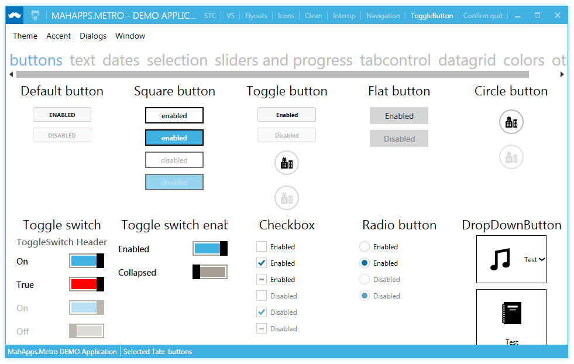
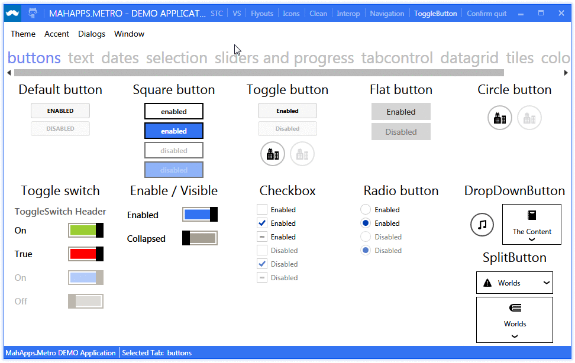
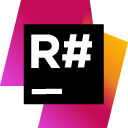
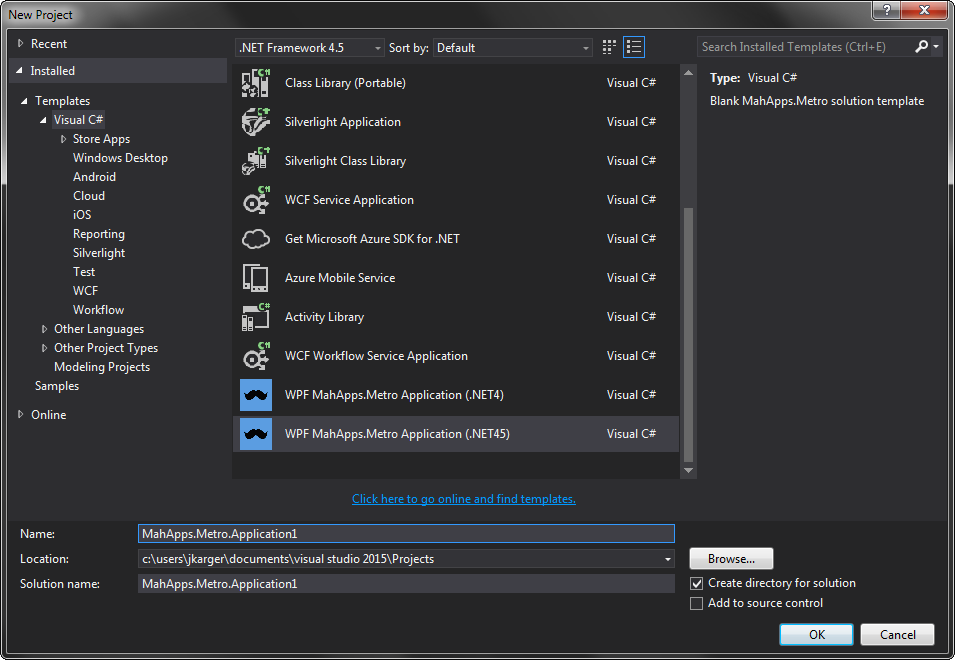

# MahApps.Metro

A toolkit for creating metro-style WPF applications. Lots of goodness out-of-the box.

[](https://gitter.im/MahApps/MahApps.Metro)

[]()
[]()
[]()

[](https://github.com/MahApps/MahApps.Metro/releases/latest)
[](http://www.nuget.org/packages/MahApps.Metro/)
[](https://github.com/MahApps/MahApps.Metro/issues)





## Documentation

You can read the documentation on the web site: [http://mahapps.com](http://mahapps.com)  
You can also help keep the documentation up to date by submitting a pull request on the  [mahapps.github.com](https://github.com/MahApps/mahapps.github.com) repository. If you're unfamiliar with GitHub Pages, the help guides [here](https://help.github.com/pages/) are a good place to start.

## Release Notes

- current [v1.2.0](./docs/release-notes/1.2.0.md)
- all [other](./docs/release-notes/)

## Icons

MahApps.Metro has also an icon package used from [WindowsIcons](https://github.com/Templarian/WindowsIcons) by [Templarian](https://github.com/Templarian)

You can download the Nuget package [here](https://www.nuget.org/packages/MahApps.Metro.Resources)

## Styles

`CheckBox` and `RadioButton` styles adapted from styles created by [Brian Lagunas of Infragistics](http://brianlagunas.com/free-metro-light-and-dark-themes-for-wpf-and-silverlight-microsoft-controls/).

## Contributing to this project

Did you stumble upon a bug? Before reporting it to us, please check out the [FAQ](https://github.com/MahApps/MahApps.Metro/wiki/FAQ) to see if it is actually a bug. If you can not find anything related to your issue, feel free to report it to us in the issue tracker.

If you've improved MahApps.Metro and think that other people would enjoy it, submit a pull request. Anyone and everyone is welcome to contribute. Please take a moment to review the [guidelines for contributing](CONTRIBUTING.md).

* [Bug reports](CONTRIBUTING.md#bugs)
* [Feature requests](CONTRIBUTING.md#features)
* [Pull requests](CONTRIBUTING.md#pull-requests)

## Missing a control?

If you're looking for a control that we don't have, we have some friends who have made MA.M compatible controls. Check them out:

- [Loading indicators](https://github.com/100GPing100/LoadingIndicators.WPF) by [@100GPing100](https://github.com/100GPing100)
- [MahApps.Metro.SimpleChildWindow](https://github.com/punker76/MahApps.Metro.SimpleChildWindow) A simple child window for MahApps.Metro
- [Dragablz](https://github.com/ButchersBoy/Dragablz) Tearable tab control for WPF, which includes docking, tool windows and MDI. [http://dragablz.net](http://dragablz.net)
- [MaterialDesignInXamlToolkit](https://github.com/ButchersBoy/MaterialDesignInXamlToolkit) Google Material Design in XAML & WPF, for C# & VB.Net [http://materialdesigninxaml.net](http://materialdesigninxaml.net)

## A short How To

Or, how to create a simple `MahApps.Metro` Application and a Window...

```XML
<Application x:Class="WpfApplication.App"
             xmlns="http://schemas.microsoft.com/winfx/2006/xaml/presentation"
             xmlns:x="http://schemas.microsoft.com/winfx/2006/xaml"
             StartupUri="MainWindow.xaml">
  <Application.Resources>
    <ResourceDictionary>
      <ResourceDictionary.MergedDictionaries>
        <ResourceDictionary Source="pack://application:,,,/MahApps.Metro;component/Styles/Controls.xaml" />
        <ResourceDictionary Source="pack://application:,,,/MahApps.Metro;component/Styles/Fonts.xaml" />
        <ResourceDictionary Source="pack://application:,,,/MahApps.Metro;component/Styles/Colors.xaml" />
        <ResourceDictionary Source="pack://application:,,,/MahApps.Metro;component/Styles/Accents/Blue.xaml" />
        <ResourceDictionary Source="pack://application:,,,/MahApps.Metro;component/Styles/Accents/BaseLight.xaml" />
      </ResourceDictionary.MergedDictionaries>
    </ResourceDictionary>
  </Application.Resources>
</Application>
```

```XML
<controls:MetroWindow x:Class="WpfApplication.MainWindow"
                      xmlns="http://schemas.microsoft.com/winfx/2006/xaml/presentation"
                      xmlns:x="http://schemas.microsoft.com/winfx/2006/xaml"
                      xmlns:controls="http://metro.mahapps.com/winfx/xaml/controls"
                      Title="MainWindow"
                      Height="600"
                      Width="800">
  <Grid>

    <!-- your content -->

  </Grid>
</controls:MetroWindow>
```

```csharp
namespace WpfApplication
{
  public partial class MainWindow : MetroWindow
  {
    public MainWindow()
    {
      InitializeComponent();
    }
  }
}
```

## Awesome tools which MahApps can use

[](https://www.jetbrains.com/teamcity/)
[](https://www.jetbrains.com/resharper/)

## Visual Studio Templates

MahApps.Metro have 4 simple templates to start with the awesome MahApps.Metro library.

* WPF MahApps.Metro Application (.NET4)
* WPF MahApps.Metro Application (.NET45)
* Visual Basic WPF MahApps.Metro Application (.NET45)
* Window MahApps.Metro (WPF)

Download this [Templates.zip](./Visual%20Studio%20Templates/Templates.zip) (templates are created with VS 2013) and extract it to your user template folder:

```
c:\Users\<USER>\Documents\Visual Studio 2013\
```

Now you can choose the templates at the `New Project` dialog.



## Breaking Changes

* For version [0.11.3.1](https://github.com/MahApps/MahApps.Metro/wiki/Breaking-Changes-or-WTF-is-happening-with-the-ALPHA-version)
* For version [0.14 to 1.0.0](./docs/v1.0-Migration-Guide.md)

## Licence

Microsoft Public License (Ms-PL)

This license governs use of the accompanying software. If you use the software, you
accept this license. If you do not accept the license, do not use the software.

1. Definitions
The terms "reproduce," "reproduction," "derivative works," and "distribution" have the
same meaning here as under U.S. copyright law.
A "contribution" is the original software, or any additions or changes to the software.
A "contributor" is any person that distributes its contribution under this license.
"Licensed patents" are a contributor's patent claims that read directly on its contribution.

2. Grant of Rights
(A) Copyright Grant- Subject to the terms of this license, including the license conditions and limitations in section 3, each contributor grants you a non-exclusive, worldwide, royalty-free copyright license to reproduce its contribution, prepare derivative works of its contribution, and distribute its contribution or any derivative works that you create.
(B) Patent Grant- Subject to the terms of this license, including the license conditions and limitations in section 3, each contributor grants you a non-exclusive, worldwide, royalty-free license under its licensed patents to make, have made, use, sell, offer for sale, import, and/or otherwise dispose of its contribution in the software or derivative works of the contribution in the software.

3. Conditions and Limitations
(A) No Trademark License- This license does not grant you rights to use any contributors' name, logo, or trademarks.
(B) If you bring a patent claim against any contributor over patents that you claim are infringed by the software, your patent license from such contributor to the software ends automatically.
(C) If you distribute any portion of the software, you must retain all copyright, patent, trademark, and attribution notices that are present in the software.
(D) If you distribute any portion of the software in source code form, you may do so only under this license by including a complete copy of this license with your distribution. If you distribute any portion of the software in compiled or object code form, you may only do so under a license that complies with this license.
(E) The software is licensed "as-is." You bear the risk of using it. The contributors give no express warranties, guarantees or conditions. You may have additional consumer rights under your local laws which this license cannot change. To the extent permitted under your local laws, the contributors exclude the implied warranties of merchantability, fitness for a particular purpose and non-infringement.
