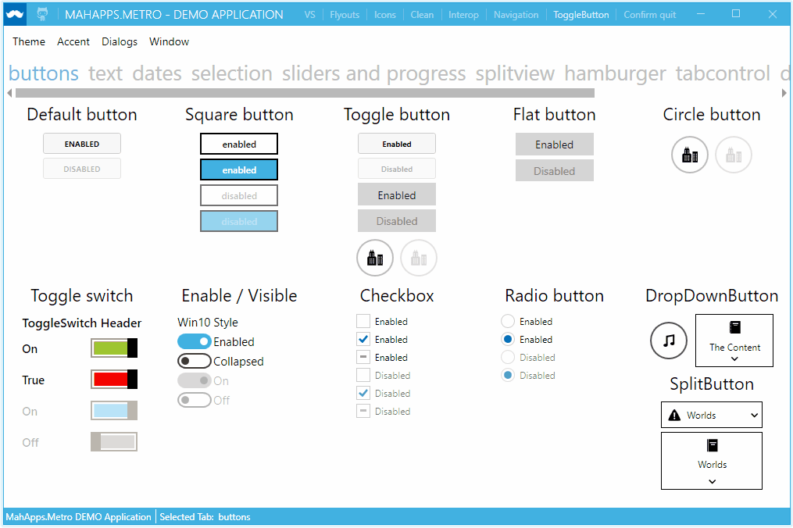
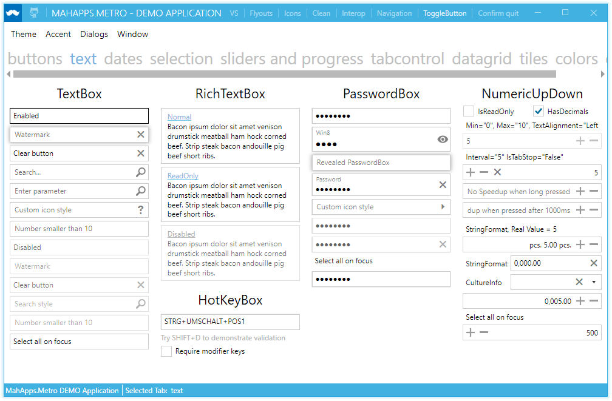
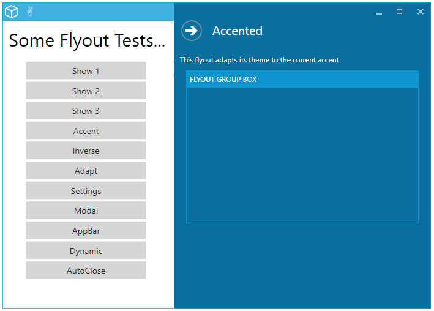
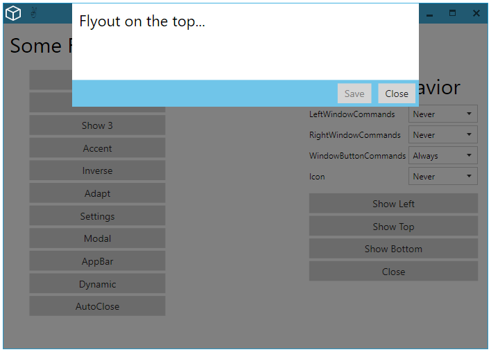

# MahApps.Metro

A toolkit for creating metro-style WPF applications. Lots of goodness out-of-the box.

[](https://gitter.im/MahApps/MahApps.Metro)

[](http://stackoverflow.com/questions/tagged/mahapps.metro)

[](https://github.com/MahApps/MahApps.Metro/releases/latest)
[](https://www.nuget.org/packages/MahApps.Metro/)
[](https://www.nuget.org/packages/MahApps.Metro/)
[](https://github.com/MahApps/MahApps.Metro/issues)

[]()
[]()

## Want to say thanks?

This framework is free and can be used for free, open source and commercial applications. It's tested and contributed by many people... So mainly hit the :star: button, that's all... thx :squirrel: (:dollar:, :euro:, :beer: or some other gifts are also being accepted...).

## Documentation

You can read the documentation on the web site: [http://mahapps.com](http://mahapps.com)  
You can also help keep the documentation up to date by submitting a pull request on the  [mahapps.github.com](https://github.com/MahApps/mahapps.github.com) repository. If you're unfamiliar with GitHub Pages, the help guides [here](https://help.github.com/pages/) are a good place to start.











## Release Notes

- [v1.4.0](./docs/release-notes/1.4.0.md)
- [v1.3.0](./docs/release-notes/1.3.0.md)
- all [other](./docs/release-notes/)

## Icons

MahApps.Metro can use the [MahApps.Metro.IconPacks](https://github.com/MahApps/MahApps.Metro.IconPacks) to use some awesome stylish and handmade icons for better cool applications.


```xaml
<iconPacks:PackIconMaterial Kind="EmoticonCool" />
```


```xaml
<iconPacks:PackIconModern Kind="ThumbsUp" />
```


```xaml
<iconPacks:PackIconFontAwesome Kind="FontAwesome" />
```


```xaml
<iconPacks:PackIconEntypo Kind="EmojiHappy" />
```


It's still possible to use the old Xaml icon resources available [here](https://github.com/MahApps/MahApps.Metro.Resources) (but you should use the new one for easier usage).

## Contributing to this project

Did you stumble upon a bug? Before reporting it to us, please check out the [FAQ](https://github.com/MahApps/MahApps.Metro/wiki/FAQ) to see if it is actually a bug. If you can not find anything related to your issue, feel free to report it to us in the issue tracker.

If you've improved MahApps.Metro and think that other people would enjoy it, submit a pull request. Anyone and everyone is welcome to contribute.

Please take a moment to review the [guidelines for contributing](.github/CONTRIBUTING.md).

* [Bug reports](.github/CONTRIBUTING.md#bugs)
* [Feature requests](.github/CONTRIBUTING.md#features)
* [Pull requests](.github/CONTRIBUTING.md#pull-requests)

You need [Visual Studio 2015 Community Edition](<https://www.visualstudio.com/>) to build the solution (comes with [#2330](https://github.com/MahApps/MahApps.Metro/pull/2330)), so we can use the new C# 6 features. You can use the [dev-vc2013](<https://github.com/MahApps/MahApps.Metro/tree/dev-vc2013>) branch if you still have the Visual Studio 2013, but no new feature or fix will be added in this branch by me™.

## Styles

`CheckBox` and `RadioButton` styles adapted from styles created by [Brian Lagunas of Infragistics](http://brianlagunas.com/free-metro-light-and-dark-themes-for-wpf-and-silverlight-microsoft-controls/).

## Missing a control?

If you're looking for a control that we don't have, we have some friends who have made MA.M compatible controls. Check them out:

- [Loading indicators](https://github.com/100GPing100/LoadingIndicators.WPF) by [@100GPing100](https://github.com/100GPing100)
- [MahApps.Metro.SimpleChildWindow](https://github.com/punker76/MahApps.Metro.SimpleChildWindow) A simple child window for MahApps.Metro
- [Dragablz](https://github.com/ButchersBoy/Dragablz) Tearable tab control for WPF, which includes docking, tool windows and MDI. [http://dragablz.net](http://dragablz.net)
- [MaterialDesignInXamlToolkit](https://github.com/ButchersBoy/MaterialDesignInXamlToolkit) Google Material Design in XAML & WPF, for C# & VB.Net [http://materialdesigninxaml.net](http://materialdesigninxaml.net)

## A short How To

Or, how to create a simple `MahApps.Metro` Application and a Window...

```XML
<Application x:Class="WpfApplication.App"
             xmlns="http://schemas.microsoft.com/winfx/2006/xaml/presentation"
             xmlns:x="http://schemas.microsoft.com/winfx/2006/xaml"
             StartupUri="MainWindow.xaml">
  <Application.Resources>
    <ResourceDictionary>
      <ResourceDictionary.MergedDictionaries>
        <ResourceDictionary Source="pack://application:,,,/MahApps.Metro;component/Styles/Controls.xaml" />
        <ResourceDictionary Source="pack://application:,,,/MahApps.Metro;component/Styles/Fonts.xaml" />
        <ResourceDictionary Source="pack://application:,,,/MahApps.Metro;component/Styles/Colors.xaml" />
        <ResourceDictionary Source="pack://application:,,,/MahApps.Metro;component/Styles/Accents/Blue.xaml" />
        <ResourceDictionary Source="pack://application:,,,/MahApps.Metro;component/Styles/Accents/BaseLight.xaml" />
      </ResourceDictionary.MergedDictionaries>
    </ResourceDictionary>
  </Application.Resources>
</Application>
```

```XML
<controls:MetroWindow x:Class="WpfApplication.MainWindow"
                      xmlns="http://schemas.microsoft.com/winfx/2006/xaml/presentation"
                      xmlns:x="http://schemas.microsoft.com/winfx/2006/xaml"
                      xmlns:controls="http://metro.mahapps.com/winfx/xaml/controls"
                      Title="MainWindow"
                      Height="600"
                      Width="800">
  <Grid>

    <!-- your content -->

  </Grid>
</controls:MetroWindow>
```

```csharp
namespace WpfApplication
{
  public partial class MainWindow : MetroWindow
  {
    public MainWindow()
    {
      InitializeComponent();
    }
  }
}
```

## Awesome tools which MahApps can use

[](https://www.jetbrains.com/teamcity/)
[](https://www.jetbrains.com/resharper/)

## Visual Studio Templates

MahApps.Metro have 4 simple templates to start with the awesome MahApps.Metro library.

* WPF MahApps.Metro Application (.NET4)
* WPF MahApps.Metro Application (.NET45)
* Visual Basic WPF MahApps.Metro Application (.NET45)
* Window MahApps.Metro (WPF)

Download this [Templates.zip](./Visual%20Studio%20Templates/Templates.zip) (templates are created with VS 2013) and extract it to your user template folder:

```
c:\Users\<USER>\Documents\Visual Studio 201x\
```

Now you can choose the templates at the `New Project` dialog.


## Breaking Changes

* For version [0.11.3.1](https://github.com/MahApps/MahApps.Metro/wiki/Breaking-Changes-or-WTF-is-happening-with-the-ALPHA-version)
* For version [0.14 to 1.0.0](./docs/v1.0-Migration-Guide.md)

## Licence

[MIT License (MIT)](./LICENSE)
