<!--  -->

   
  <a href="https://github.com/MahApps/MahApps.Metro">
    <!-- 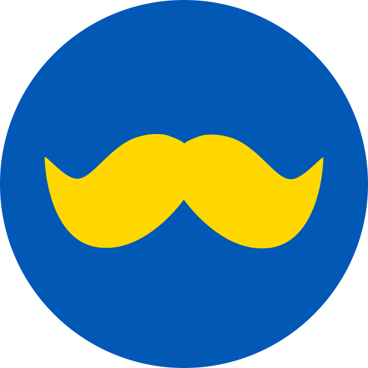 -->
    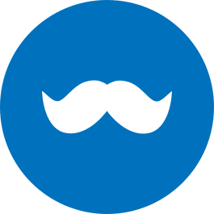
  </a>
  <h1>MahApps.Metro</h1>
  

    A toolkit for creating awesome WPF applications. Lots of goodness out-of-the box.
  

  

    Supporting .NET Framework 4.6.2 and greater, .NET 6 and .NET 8 (on Windows)
  

  
  
  
  
  
   
  
  
  
   
  
  
  
  

## What it is

MahApps.Metro is a UI toolkit for WPF. It takes the standard WPF controls, the ones you already use, gives them a clean and modern look, and adds the pieces WPF never shipped: a proper window chrome, a theming engine, dialogs that do not block, and a set of navigation controls.

The project started on 29 January 2011, is MIT licensed, and has been part of the [.NET Foundation](https://dotnetfoundation.org) since 2020. More than 160 people have contributed to it.

**It restyles what you already have.** Most UI libraries ask you to swap your controls for theirs. MahApps.Metro does the opposite: reference it, merge two resource dictionaries, and your existing `Button`, `TextBox`, `DataGrid` and `TreeView` are restyled in place. No rewrite, no new control names, no vendor lock-in on your XAML.

**A window that looks like an app.** `MetroWindow` replaces the Windows title bar with one you control: your own commands to the left and right of the title, a coloured glow border, an overlay for dialogs, and flyouts that slide in from any edge.

**Theming is a first-class feature.** A theme is a base theme (Light or Dark) plus an accent colour, switchable at runtime, and `ThemeManager` can follow the Windows accent colour and the system light/dark setting. You can generate your own themes from the same scheme the built-in ones use.

**Helpers instead of subclasses.** Watermarks, clear buttons, per-control corner radii, spell-check styling and selected-item brushes arrive as attached properties such as `TextBoxHelper.Watermark`, so you attach behaviour to a stock control instead of inheriting from a special one.

## What you can build with it

- [Windows and chrome](https://mahapps.github.io/mahapps.com/docs/controls/): `MetroWindow` with custom title-bar commands and glow borders, `MetroNavigationWindow` for page-based navigation.
- Navigation: a `HamburgerMenu` for the side-bar pattern, a `SplitView` underneath it, flyouts from any edge, and animated tab controls.
- [Dialogs](https://mahapps.github.io/mahapps.com/docs/dialogs/): message, input, login and progress dialogs shown as an overlay inside your window instead of a blocking modal. They are awaitable and usable from a view model.
- Input and data: `ColorPicker`, `DateTimePicker`, `NumericUpDown`, `MultiSelectionComboBox`, `HotKeyBox` and a [restyled `DataGrid`](https://mahapps.github.io/mahapps.com/docs/styles/).
- Feedback: badges, progress bars and rings, toggle switches and validation popups.
- Look and feel: [themes](https://mahapps.github.io/mahapps.com/docs/themes/) you can switch at runtime and [style variants](https://mahapps.github.io/mahapps.com/docs/stylevariants/) that follow Visual Studio, Windows 10 or WinUI conventions.

## Versions

Version 2.4 runs on .NET Framework 4.5.2 and newer as well as .NET Core 3.x. Version 3.0, on NuGet as a release candidate, targets .NET Framework 4.6.2, .NET 6 and .NET 8, and brings the window chrome up to date with Windows 11: the caption buttons are registered as non-client controls, so the maximise button takes part in snap layouts, and the window can use the newer backdrop materials.

## Let's get started

- [Documentation](https://mahapps.github.io/mahapps.com/) and [Quick Start](https://mahapps.github.io/mahapps.com/docs/guides/)
- [Icons](https://github.com/MahApps/MahApps.Metro/wiki/Icons) (MahApps.Metro.IconPacks)
- [Contributing](https://github.com/MahApps/MahApps.Metro/wiki/Contributing) to MahApps.Metro
- [Building](https://github.com/MahApps/MahApps.Metro/wiki/Building-the-MahApps.Metro-solution) the MahApps.Metro solution
- [Releases and Release Notes](https://github.com/MahApps/MahApps.Metro/releases)
- [Visual Studio Templates](https://github.com/MahApps/MahApps.Metro/wiki/Visual-Studio-Templates)
- [Wiki](https://github.com/MahApps/MahApps.Metro/wiki)

## Get in touch

## Awesome Application Samples

### Master Packager

  <a href="https://www.masterpackager.com/master-packager">
    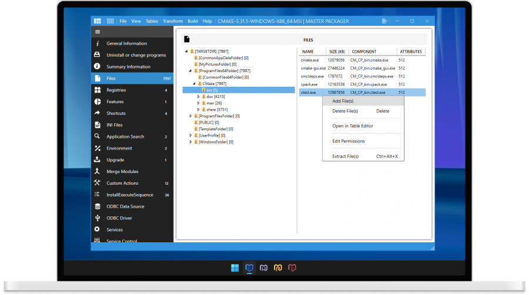
  </a>
  
Software to view, create and edit Microsoft Windows Installer (MSI)/MST files for free

### Markdown Monster

  <a href="https://markdownmonster.west-wind.com">
    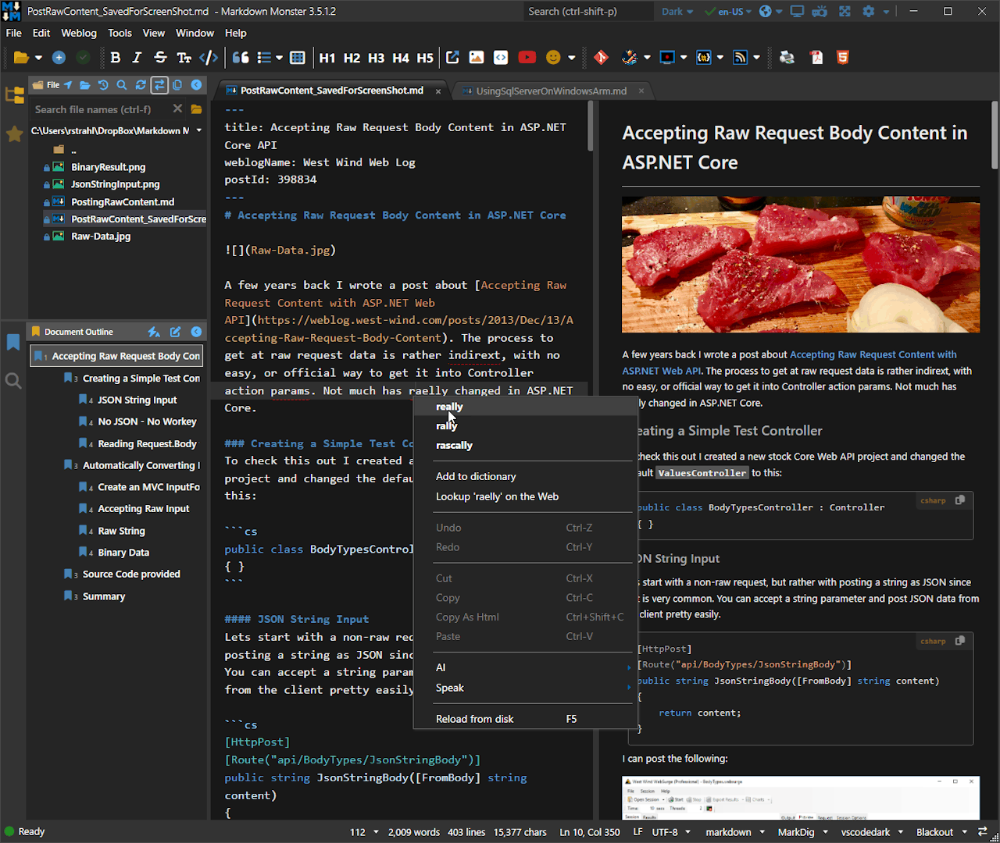
  </a>
  
An extensible Markdown Editor, Viewer and Weblog Publisher for Windows by <a href="https://github.com/RickStrahl">@RickStrahl</a>

### Chocolatey GUI

  <a href="https://github.com/chocolatey/ChocolateyGUI">
    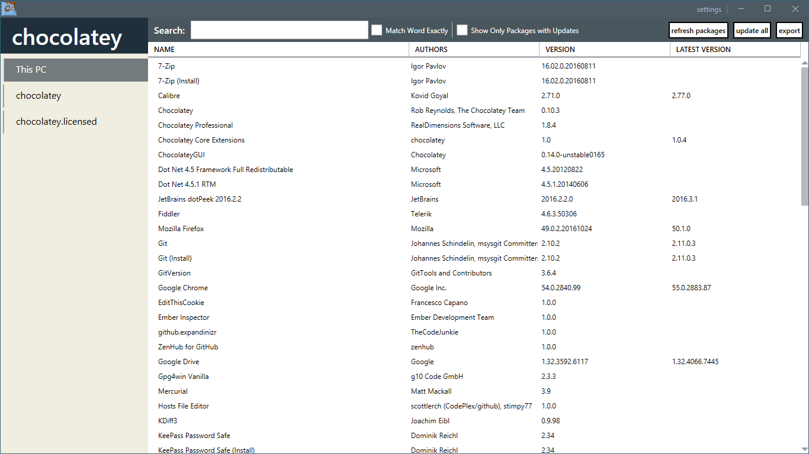
  </a>
  
A user interface for <a href="https://chocolatey.org/">Chocolatey</a> (a Machine Package Manager for Windows)

### NETworkManager

  <a href="https://github.com/BornToBeRoot/NETworkManager">
    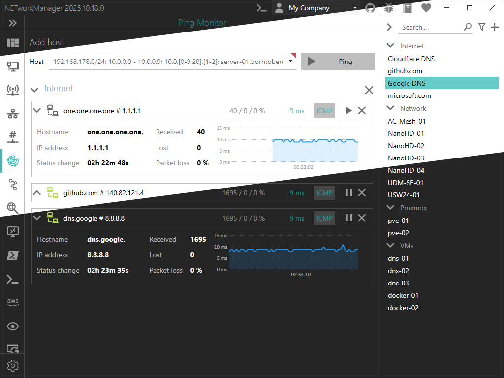
  </a>
  
A powerful tool for managing networks and troubleshoot network problems by <a href="https://github.com/BornToBeRoot">@BornToBeRoot</a>

### Other Projects

* [Showcase/Demo application](./src/MahApps.Metro.Samples/MahApps.Metro.Demo) The showcase/demo application built by the MahApps.Metro team. Compiled versions can be downloaded from [releases](https://github.com/MahApps/MahApps.Metro/releases) and preview versions can be downloaded from [CI artifacts](https://ci.appveyor.com/project/punker76/mahapps-metro/branch/develop/artifacts)
* [Azuser](https://github.com/Inzanit/azuser) by [@Inzanit](https://github.com/Inzanit) Azure SQL Server User Management
* [Carnac](https://github.com/Code52/carnac) by [@Code52](https://github.com/Code52) the Magnificent Keyboard Utility
* [Certify The Web](https://github.com/webprofusion/certify) by [@webprofusion](https://github.com/webprofusion) The GUI to manage free certificates from Let's Encrypt
* [CodeTrack](http://www.getcodetrack.com) by [Nico Van Goethem](https://twitter.com/GoethemNico) CodeTrack is a versatile profiler with some extra tricks up its sleeve.
* [FolderSecurityViewer](https://www.foldersecurityviewer.com) Easy to use NTFS permissions reporter to get all effective security owners of your data
* [Hearthstone-Deck-Tracker](https://github.com/Epix37/Hearthstone-Deck-Tracker) by [@Epix37](https://github.com/Epix37) HDT is an automatic deck tracker and manager for Hearthstone
* [Markdown Edit](https://github.com/mike-ward/Markdown-Edit) by [@mike-ward](https://github.com/mike-ward) A full-featured Markdown editor for Windows with an emphasis on content and keyboard shortcuts
* [MarkPad (DownmarkerWPF)](https://github.com/Code52/DownmarkerWPF) by [@Code52](https://github.com/Code52) a visual Markdown editor
* [Modern UI for WPF (MUI)](https://github.com/firstfloorsoftware/mui) Inspired by MahApps.Metro
* [Papercut](https://github.com/jaben/papercut) by [@Jaben](https://github.com/Jaben) Simple Desktop SMTP Server / Email Receiver
* [RainyDay Backup](https://www.copidal.com) Backup system for Azure DevOps Services and Azure Devops Server
* [SimpleMP](https://github.com/punker76/simple-music-player) by [@punker76](https://github.com/punker76) Simple Music Player - SimpleMP - Keeps it simple and plays your music
* [Solutionizer](https://github.com/thoemmi/Solutionizer) by [@thoemmi](https://github.com/thoemmi) Creating ad-hoc solutions for Visual Studio
* [Version Changer](https://marketplace.visualstudio.com/items?itemName=Newky2k.VersionChanger2022) Version Changer is a Visual Studio extension that makes it simple to change the version numbers of all the projects in a solution.
* [WinReform](https://github.com/AKruimink/WinReform) by [@AKruimink](https://github.com/AKruimink) A simple tool to help resize and relocate stubborn windows.
* [Xamarin Inspector](https://docs.microsoft.com/en-us/xamarin/tools/inspector/release-notes/) Visualize and debug your live app
* [Xamarin Workbooks](https://github.com/microsoft/workbooks) Xamarin Workbooks provide a blend of documentation and code that is perfect for experimentation, learning, and creating guides and teaching aids.

## License

Copyright © .NET Foundation, Jan Karger, Brendan Forster, Dennis Daume, Alex Mitchell, Paul Jenkins and contributors.

MahApps.Metro is provided as-is under the MIT license. For more information see [LICENSE](./LICENSE).

## Code of Conduct

This project has adopted the code of conduct defined by the [Contributor Covenant](http://contributor-covenant.org/)
to clarify expected behavior in our community.
For more information see the [.NET Foundation Code of Conduct](http://www.dotnetfoundation.org/code-of-conduct).

## Contribution License Agreement

By signing the [CLA](https://cla.dotnetfoundation.org/MahApps/MahApps.Metro), the community is free to use your contribution to .NET Foundation projects.

## .NET Foundation

This project is supported by the [.NET Foundation](http://www.dotnetfoundation.org).

## Dev Tools

We want to give some :heart: to this dev tools which makes the work a little bit easier!

- [Cake (C# Make)](https://cakebuild.net/) a free and open source cross-platform build automation system.
- [ReSharper](https://www.jetbrains.com/resharper/)
- [Rider](https://www.jetbrains.com/rider/)
- [AppVeyor](https://www.appveyor.com/) CI/CD service for Windows, Linux and macOS

A big thank goes to [JetBrains](https://www.jetbrains.com) who provide an [Open Source License](https://www.jetbrains.com/community/opensource/) for ReSharper and Rider.

## Contributors

A big virtual hug :hugs: goes to all the great people around the world who contributed to this project!

## Something missing?

If you're looking for other awesome libraries which are compatible with MahApps, check them out:

- [MaterialDesignInXamlToolkit](https://github.com/ButchersBoy/MaterialDesignInXamlToolkit) Comprehensive and easy to use Material Design theme and control library for the Windows desktop. [http://materialdesigninxaml.net](http://materialdesigninxaml.net)
- [Fluent.Ribbon](https://github.com/fluentribbon/Fluent.Ribbon) made by [@batzen](https://github.com/batzen) a library that implements an Office-like user interface for the Windows Presentation Foundation (WPF).
- [MahApps.Metro.SimpleChildWindow](https://github.com/punker76/MahApps.Metro.SimpleChildWindow) A simple child window for MahApps.Metro.
- [LoadingIndicators.WPF](https://github.com/zeluisping/LoadingIndicators.WPF) made by [@zeluisping](https://github.com/zeluisping)
- [Dragablz](https://github.com/ButchersBoy/Dragablz) Tearable tab control for WPF, which includes docking, tool windows and MDI. [http://dragablz.net](http://dragablz.net)

## Sponsoring

This framework is free and can be used for free, open source and commercial applications. MahApps.Metro (all code, NuGets and binaries) are under the [MIT License (MIT)](./LICENSE). It's tested, used and contributed by many awesome people. So hit the magic :star: button, we appreciate it!!! :pray:

The core team member(s), MahApps.Metro contributors and contributors in the ecosystem do this open source work in their free time. If you use MahApps.Metro a serious task, and you'd like us to invest more time on it, please donate. This project increases your income/productivity/usability too.

[Become a sponsor](https://github.com/sponsors/punker76) and show your support to this open source project.

### :pray: All OpenCollective Backers (archived) :heart:

## Screenshots

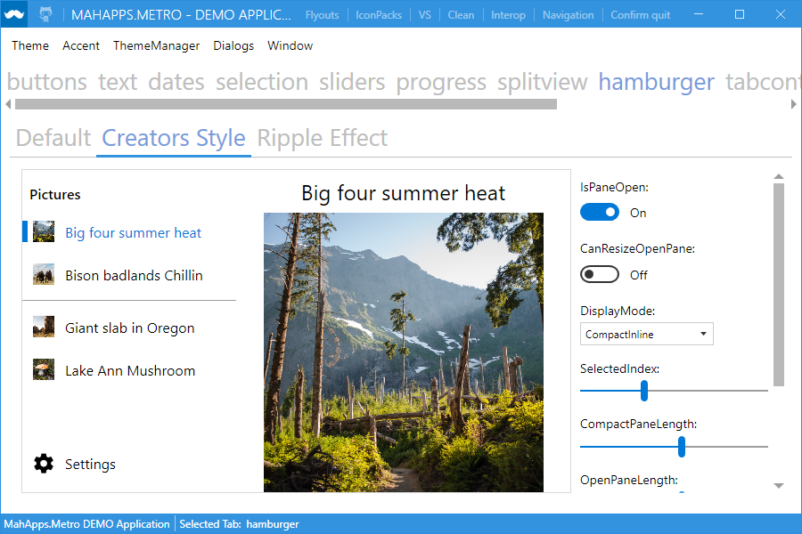

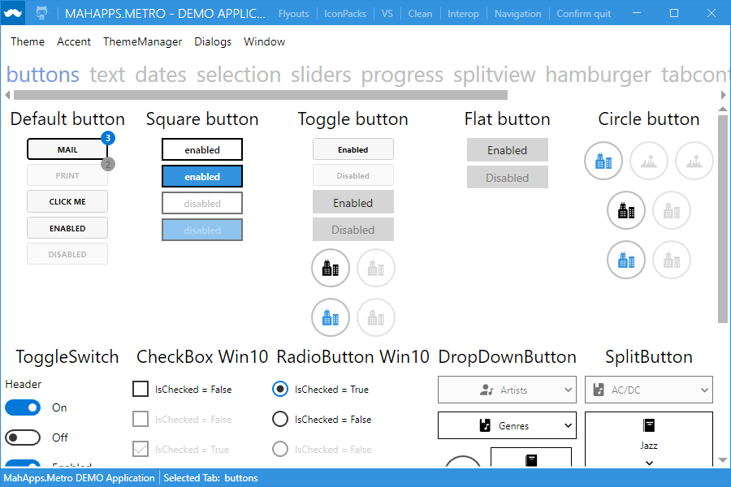

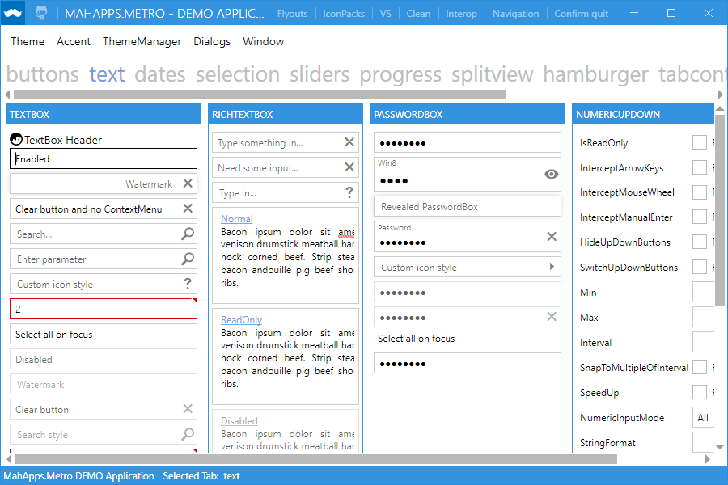

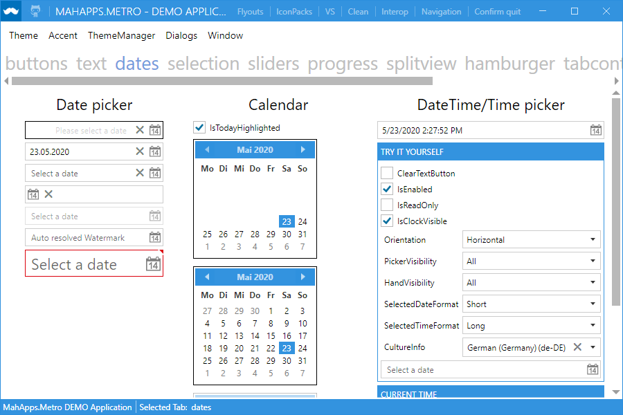

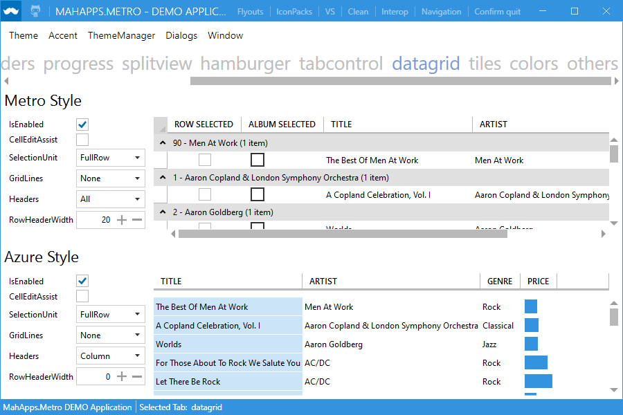

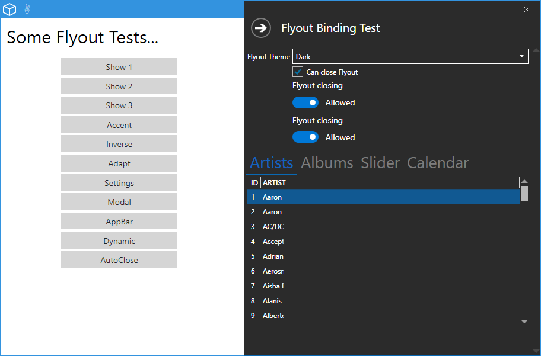

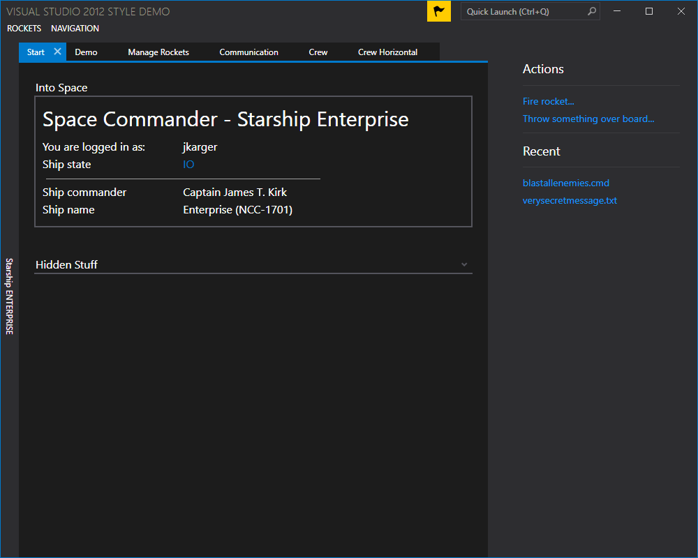

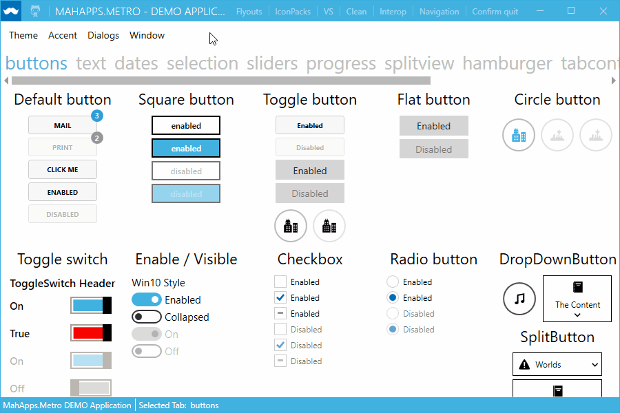

